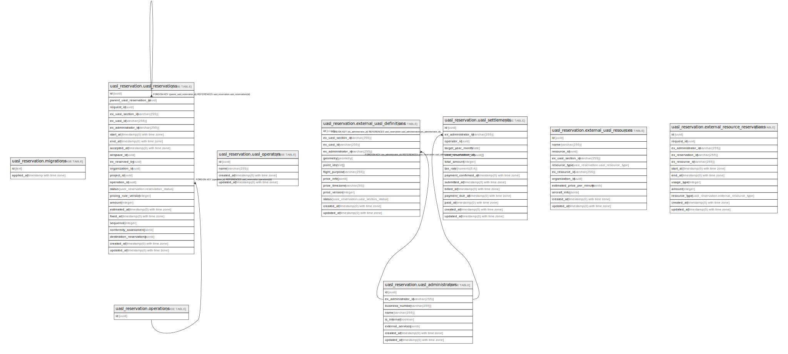

# DBドキュメント

## Tables

| Name | Columns | Comment | Type |
| ---- | ------- | ------- | ---- |
| [uasl_reservation.migrations](uasl_reservation.migrations.md) | 2 |  | BASE TABLE |
| [uasl_reservation.operations](uasl_reservation.operations.md) | 1 |  | BASE TABLE |
| [uasl_reservation.uasl_operators](uasl_reservation.uasl_operators.md) | 4 |  | BASE TABLE |
| [uasl_reservation.uasl_administrators](uasl_reservation.uasl_administrators.md) | 8 |  | BASE TABLE |
| [uasl_reservation.external_uasl_definitions](uasl_reservation.external_uasl_definitions.md) | 13 |  | BASE TABLE |
| [uasl_reservation.external_uasl_resources](uasl_reservation.external_uasl_resources.md) | 11 |  | BASE TABLE |
| [uasl_reservation.uasl_reservations](uasl_reservation.uasl_reservations.md) | 24 |  | BASE TABLE |
| [uasl_reservation.external_resource_reservations](uasl_reservation.external_resource_reservations.md) | 12 |  | BASE TABLE |
| [uasl_reservation.uasl_settlements](uasl_reservation.uasl_settlements.md) | 14 |  | BASE TABLE |

## Stored procedures and functions

| Name | ReturnType | Arguments | Type |
| ---- | ------- | ------- | ---- |
| uasl_reservation.uuid_nil | uuid |  | FUNCTION |
| uasl_reservation.uuid_ns_dns | uuid |  | FUNCTION |
| uasl_reservation.uuid_ns_url | uuid |  | FUNCTION |
| uasl_reservation.uuid_ns_oid | uuid |  | FUNCTION |
| uasl_reservation.uuid_ns_x500 | uuid |  | FUNCTION |
| uasl_reservation.uuid_generate_v1 | uuid |  | FUNCTION |
| uasl_reservation.uuid_generate_v1mc | uuid |  | FUNCTION |
| uasl_reservation.uuid_generate_v3 | uuid | namespace uuid, name text | FUNCTION |
| uasl_reservation.uuid_generate_v4 | uuid |  | FUNCTION |
| uasl_reservation.uuid_generate_v5 | uuid | namespace uuid, name text | FUNCTION |

## Enums

| Name | Values |
| ---- | ------- |
| uasl_reservation.external_resource_type | PAYLOAD, PORT, VEHICLE |
| uasl_reservation.reservation_status | CANCELED, INHERITED, PENDING, RESCINDED, RESERVED |
| uasl_reservation.uasl_resource_type | PAYLOAD, PORT, VEHICLE |
| uasl_reservation.uasl_section_status | AVAILABLE, CLOSED |

## Relations

---

> Generated by [tbls](https://github.com/k1LoW/tbls)
