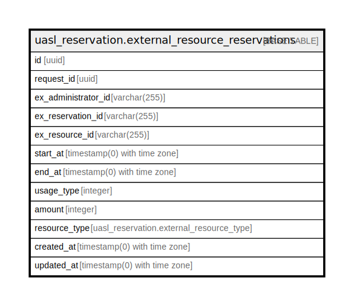

# uasl_reservation.external_resource_reservations

## Description

## Columns

| Name | Type | Default | Nullable | Children | Parents | Comment |
| ---- | ---- | ------- | -------- | -------- | ------- | ------- |
| id | uuid | uasl_reservation.uuid_generate_v4() | false |  |  |  |
| request_id | uuid |  | false |  |  |  |
| ex_administrator_id | varchar(255) |  | false |  |  |  |
| ex_reservation_id | varchar(255) |  | true |  |  |  |
| ex_resource_id | varchar(255) |  | false |  |  |  |
| start_at | timestamp(0) with time zone |  | true |  |  |  |
| end_at | timestamp(0) with time zone |  | true |  |  |  |
| usage_type | integer |  | true |  |  |  |
| amount | integer |  | true |  |  |  |
| resource_type | uasl_reservation.external_resource_type |  | false |  |  |  |
| created_at | timestamp(0) with time zone | now() | false |  |  |  |
| updated_at | timestamp(0) with time zone | now() | false |  |  |  |

## Constraints

| Name | Type | Definition |
| ---- | ---- | ---------- |
| external_resource_reservations_pkey | PRIMARY KEY | PRIMARY KEY (id) |

## Indexes

| Name | Definition |
| ---- | ---------- |
| external_resource_reservations_pkey | CREATE UNIQUE INDEX external_resource_reservations_pkey ON uasl_reservation.external_resource_reservations USING btree (id) |
| idx_external_resource_reservations_request_id | CREATE INDEX idx_external_resource_reservations_request_id ON uasl_reservation.external_resource_reservations USING btree (request_id) |
| idx_external_resource_reservations_ex_administrator_id | CREATE INDEX idx_external_resource_reservations_ex_administrator_id ON uasl_reservation.external_resource_reservations USING btree (ex_administrator_id) |
| idx_external_resource_reservations_ex_resource_id | CREATE INDEX idx_external_resource_reservations_ex_resource_id ON uasl_reservation.external_resource_reservations USING btree (ex_resource_id) |

## Relations

---

> Generated by [tbls](https://github.com/k1LoW/tbls)
