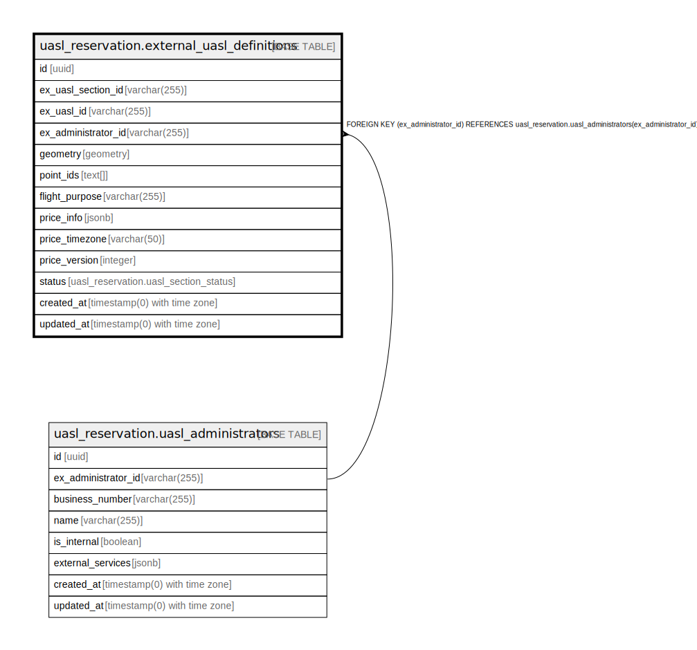

# uasl_reservation.external_uasl_definitions

## Description

## Columns

| Name | Type | Default | Nullable | Children | Parents | Comment |
| ---- | ---- | ------- | -------- | -------- | ------- | ------- |
| id | uuid | uasl_reservation.uuid_generate_v4() | false |  |  |  |
| ex_uasl_section_id | varchar(255) |  | false |  |  |  |
| ex_uasl_id | varchar(255) |  | true |  |  |  |
| ex_administrator_id | varchar(255) |  | false |  | [uasl_reservation.uasl_administrators](uasl_reservation.uasl_administrators.md) |  |
| geometry | geometry |  | false |  |  |  |
| point_ids | text[] |  | false |  |  |  |
| flight_purpose | varchar(255) |  | true |  |  |  |
| price_info | jsonb |  | true |  |  |  |
| price_timezone | varchar(50) | 'UTC'::character varying | false |  |  |  |
| price_version | integer | 1 | false |  |  |  |
| status | uasl_reservation.uasl_section_status | 'AVAILABLE'::uasl_reservation.uasl_section_status | false |  |  |  |
| created_at | timestamp(0) with time zone | now() | false |  |  |  |
| updated_at | timestamp(0) with time zone | now() | false |  |  |  |

## Constraints

| Name | Type | Definition |
| ---- | ---- | ---------- |
| fk_external_uasl_definitions_administrator_id | FOREIGN KEY | FOREIGN KEY (ex_administrator_id) REFERENCES uasl_reservation.uasl_administrators(ex_administrator_id) |
| external_uasl_definitions_pkey | PRIMARY KEY | PRIMARY KEY (id) |
| external_uasl_definitions_ex_uasl_section_id_key | UNIQUE | UNIQUE (ex_uasl_section_id) |

## Indexes

| Name | Definition |
| ---- | ---------- |
| external_uasl_definitions_pkey | CREATE UNIQUE INDEX external_uasl_definitions_pkey ON uasl_reservation.external_uasl_definitions USING btree (id) |
| external_uasl_definitions_ex_uasl_section_id_key | CREATE UNIQUE INDEX external_uasl_definitions_ex_uasl_section_id_key ON uasl_reservation.external_uasl_definitions USING btree (ex_uasl_section_id) |
| idx_external_uasl_definitions_ex_uasl_section_id | CREATE INDEX idx_external_uasl_definitions_ex_uasl_section_id ON uasl_reservation.external_uasl_definitions USING btree (ex_uasl_section_id) |
| idx_external_uasl_definitions_ex_administrator_id | CREATE INDEX idx_external_uasl_definitions_ex_administrator_id ON uasl_reservation.external_uasl_definitions USING btree (ex_administrator_id) |
| idx_external_uasl_definitions_geometry | CREATE INDEX idx_external_uasl_definitions_geometry ON uasl_reservation.external_uasl_definitions USING gist (geometry) |
| idx_external_uasl_definitions_point_ids | CREATE INDEX idx_external_uasl_definitions_point_ids ON uasl_reservation.external_uasl_definitions USING gin (point_ids) |

## Relations

---

> Generated by [tbls](https://github.com/k1LoW/tbls)
