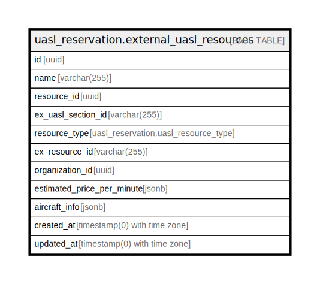

# uasl_reservation.external_uasl_resources

## Description

## Columns

| Name | Type | Default | Nullable | Children | Parents | Comment |
| ---- | ---- | ------- | -------- | -------- | ------- | ------- |
| id | uuid | uasl_reservation.uuid_generate_v4() | false |  |  |  |
| name | varchar(255) |  | false |  |  |  |
| resource_id | uuid |  | true |  |  |  |
| ex_uasl_section_id | varchar(255) |  | true |  |  |  |
| resource_type | uasl_reservation.uasl_resource_type |  | false |  |  |  |
| ex_resource_id | varchar(255) |  | false |  |  |  |
| organization_id | uuid |  | true |  |  |  |
| estimated_price_per_minute | jsonb |  | true |  |  |  |
| aircraft_info | jsonb |  | true |  |  |  |
| created_at | timestamp(0) with time zone | now() | false |  |  |  |
| updated_at | timestamp(0) with time zone | now() | false |  |  |  |

## Constraints

| Name | Type | Definition |
| ---- | ---- | ---------- |
| external_uasl_resources_pkey | PRIMARY KEY | PRIMARY KEY (id) |
| external_uasl_resources_ex_resource_id_key | UNIQUE | UNIQUE (ex_resource_id) |

## Indexes

| Name | Definition |
| ---- | ---------- |
| external_uasl_resources_pkey | CREATE UNIQUE INDEX external_uasl_resources_pkey ON uasl_reservation.external_uasl_resources USING btree (id) |
| external_uasl_resources_ex_resource_id_key | CREATE UNIQUE INDEX external_uasl_resources_ex_resource_id_key ON uasl_reservation.external_uasl_resources USING btree (ex_resource_id) |
| idx_external_uasl_resources_ex_resource_id | CREATE INDEX idx_external_uasl_resources_ex_resource_id ON uasl_reservation.external_uasl_resources USING btree (ex_resource_id) |
| idx_external_uasl_resources_section_id | CREATE INDEX idx_external_uasl_resources_section_id ON uasl_reservation.external_uasl_resources USING btree (ex_uasl_section_id) |
| idx_external_uasl_resources_organization_id | CREATE INDEX idx_external_uasl_resources_organization_id ON uasl_reservation.external_uasl_resources USING btree (organization_id) |

## Relations

---

> Generated by [tbls](https://github.com/k1LoW/tbls)
