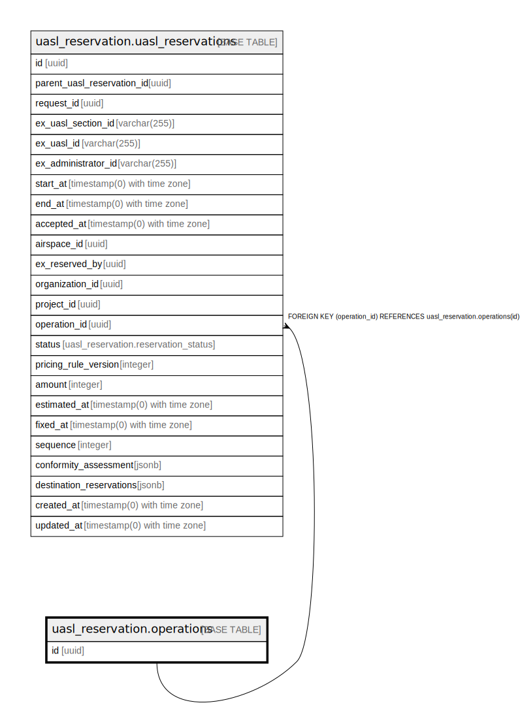

# uasl_reservation.operations

## Description

## Columns

| Name | Type | Default | Nullable | Children | Parents | Comment |
| ---- | ---- | ------- | -------- | -------- | ------- | ------- |
| id | uuid | uasl_reservation.uuid_generate_v4() | false | [uasl_reservation.uasl_reservations](uasl_reservation.uasl_reservations.md) |  |  |

## Constraints

| Name | Type | Definition |
| ---- | ---- | ---------- |
| operations_pkey | PRIMARY KEY | PRIMARY KEY (id) |

## Indexes

| Name | Definition |
| ---- | ---------- |
| operations_pkey | CREATE UNIQUE INDEX operations_pkey ON uasl_reservation.operations USING btree (id) |

## Relations

---

> Generated by [tbls](https://github.com/k1LoW/tbls)
