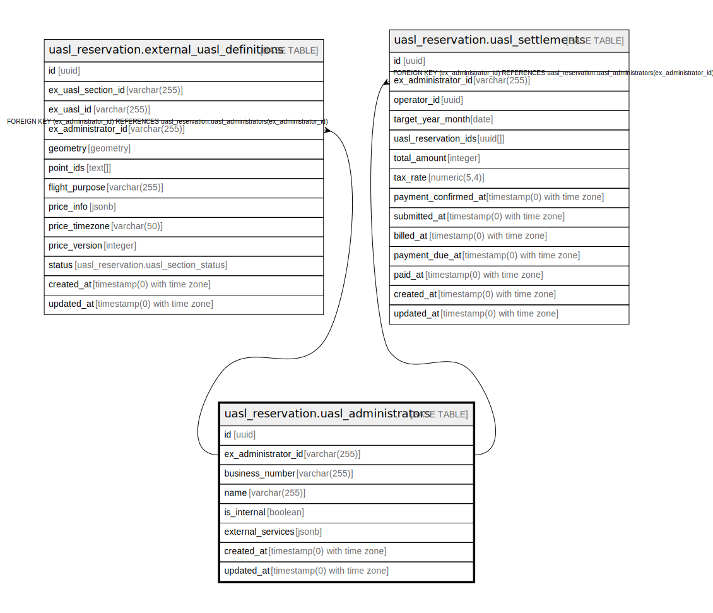

# uasl_reservation.uasl_administrators

## Description

## Columns

| Name | Type | Default | Nullable | Children | Parents | Comment |
| ---- | ---- | ------- | -------- | -------- | ------- | ------- |
| id | uuid | uasl_reservation.uuid_generate_v4() | false |  |  |  |
| ex_administrator_id | varchar(255) |  | false | [uasl_reservation.external_uasl_definitions](uasl_reservation.external_uasl_definitions.md) [uasl_reservation.uasl_settlements](uasl_reservation.uasl_settlements.md) |  |  |
| business_number | varchar(255) |  | true |  |  |  |
| name | varchar(255) |  | false |  |  |  |
| is_internal | boolean | false | false |  |  |  |
| external_services | jsonb |  | true |  |  |  |
| created_at | timestamp(0) with time zone | now() | false |  |  |  |
| updated_at | timestamp(0) with time zone | now() | false |  |  |  |

## Constraints

| Name | Type | Definition |
| ---- | ---- | ---------- |
| uasl_administrators_pkey | PRIMARY KEY | PRIMARY KEY (id) |
| uasl_administrators_ex_administrator_id_key | UNIQUE | UNIQUE (ex_administrator_id) |

## Indexes

| Name | Definition |
| ---- | ---------- |
| uasl_administrators_pkey | CREATE UNIQUE INDEX uasl_administrators_pkey ON uasl_reservation.uasl_administrators USING btree (id) |
| uasl_administrators_ex_administrator_id_key | CREATE UNIQUE INDEX uasl_administrators_ex_administrator_id_key ON uasl_reservation.uasl_administrators USING btree (ex_administrator_id) |
| idx_uasl_administrators_ex_administrator_id | CREATE INDEX idx_uasl_administrators_ex_administrator_id ON uasl_reservation.uasl_administrators USING btree (ex_administrator_id) |

## Relations

---

> Generated by [tbls](https://github.com/k1LoW/tbls)
