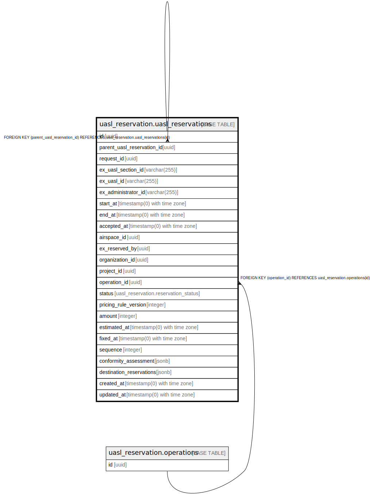

# uasl_reservation.uasl_reservations

## Description

## Columns

| Name | Type | Default | Nullable | Children | Parents | Comment |
| ---- | ---- | ------- | -------- | -------- | ------- | ------- |
| id | uuid | uasl_reservation.uuid_generate_v4() | false | [uasl_reservation.uasl_reservations](uasl_reservation.uasl_reservations.md) |  |  |
| parent_uasl_reservation_id | uuid |  | true |  | [uasl_reservation.uasl_reservations](uasl_reservation.uasl_reservations.md) |  |
| request_id | uuid |  | false |  |  |  |
| ex_uasl_section_id | varchar(255) |  | true |  |  |  |
| ex_uasl_id | varchar(255) |  | true |  |  |  |
| ex_administrator_id | varchar(255) |  | true |  |  |  |
| start_at | timestamp(0) with time zone |  | false |  |  |  |
| end_at | timestamp(0) with time zone |  | false |  |  |  |
| accepted_at | timestamp(0) with time zone |  | true |  |  |  |
| airspace_id | uuid |  | false |  |  |  |
| ex_reserved_by | uuid |  | true |  |  |  |
| organization_id | uuid |  | true |  |  |  |
| project_id | uuid |  | true |  |  |  |
| operation_id | uuid |  | true |  | [uasl_reservation.operations](uasl_reservation.operations.md) |  |
| status | uasl_reservation.reservation_status |  | false |  |  |  |
| pricing_rule_version | integer |  | true |  |  |  |
| amount | integer |  | true |  |  |  |
| estimated_at | timestamp(0) with time zone |  | true |  |  |  |
| fixed_at | timestamp(0) with time zone |  | true |  |  |  |
| sequence | integer |  | true |  |  |  |
| conformity_assessment | jsonb |  | true |  |  |  |
| destination_reservations | jsonb |  | true |  |  |  |
| created_at | timestamp(0) with time zone | now() | false |  |  |  |
| updated_at | timestamp(0) with time zone | now() | false |  |  |  |

## Constraints

| Name | Type | Definition |
| ---- | ---- | ---------- |
| fk_uasl_reservations_operation_id | FOREIGN KEY | FOREIGN KEY (operation_id) REFERENCES uasl_reservation.operations(id) |
| fk_uasl_reservations_parent_id | FOREIGN KEY | FOREIGN KEY (parent_uasl_reservation_id) REFERENCES uasl_reservation.uasl_reservations(id) |
| uasl_reservations_pkey | PRIMARY KEY | PRIMARY KEY (id) |

## Indexes

| Name | Definition |
| ---- | ---------- |
| uasl_reservations_pkey | CREATE UNIQUE INDEX uasl_reservations_pkey ON uasl_reservation.uasl_reservations USING btree (id) |
| idx_uasl_reservations_request_id | CREATE INDEX idx_uasl_reservations_request_id ON uasl_reservation.uasl_reservations USING btree (request_id) |
| idx_uasl_reservations_ex_administrator_id | CREATE INDEX idx_uasl_reservations_ex_administrator_id ON uasl_reservation.uasl_reservations USING btree (ex_administrator_id) |
| idx_uasl_reservations_ex_uasl_section_id | CREATE INDEX idx_uasl_reservations_ex_uasl_section_id ON uasl_reservation.uasl_reservations USING btree (ex_uasl_section_id) |
| idx_uasl_reservations_organization_id | CREATE INDEX idx_uasl_reservations_organization_id ON uasl_reservation.uasl_reservations USING btree (organization_id) |
| idx_uasl_reservations_project_id | CREATE INDEX idx_uasl_reservations_project_id ON uasl_reservation.uasl_reservations USING btree (project_id) |
| idx_uasl_reservations_time_range | CREATE INDEX idx_uasl_reservations_time_range ON uasl_reservation.uasl_reservations USING btree (start_at, end_at) |

## Relations

---

> Generated by [tbls](https://github.com/k1LoW/tbls)
