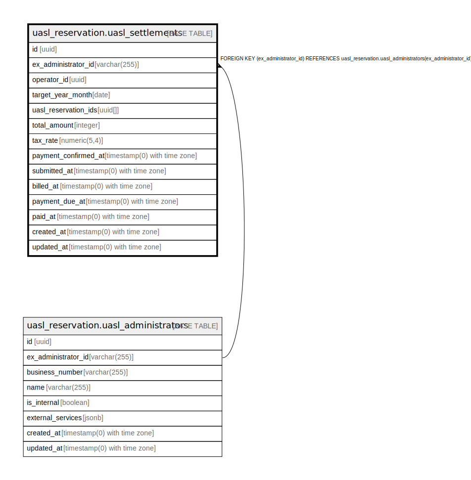

# uasl_reservation.uasl_settlements

## Description

## Columns

| Name | Type | Default | Nullable | Children | Parents | Comment |
| ---- | ---- | ------- | -------- | -------- | ------- | ------- |
| id | uuid | uasl_reservation.uuid_generate_v4() | false |  |  |  |
| ex_administrator_id | varchar(255) |  | false |  | [uasl_reservation.uasl_administrators](uasl_reservation.uasl_administrators.md) |  |
| operator_id | uuid |  | false |  |  |  |
| target_year_month | date |  | false |  |  |  |
| uasl_reservation_ids | uuid[] |  | true |  |  |  |
| total_amount | integer |  | false |  |  |  |
| tax_rate | numeric(5,4) |  | false |  |  |  |
| payment_confirmed_at | timestamp(0) with time zone |  | true |  |  |  |
| submitted_at | timestamp(0) with time zone |  | true |  |  |  |
| billed_at | timestamp(0) with time zone |  | true |  |  |  |
| payment_due_at | timestamp(0) with time zone |  | true |  |  |  |
| paid_at | timestamp(0) with time zone |  | true |  |  |  |
| created_at | timestamp(0) with time zone | now() | false |  |  |  |
| updated_at | timestamp(0) with time zone | now() | false |  |  |  |

## Constraints

| Name | Type | Definition |
| ---- | ---- | ---------- |
| fk_uasl_settlements_ex_administrator_id | FOREIGN KEY | FOREIGN KEY (ex_administrator_id) REFERENCES uasl_reservation.uasl_administrators(ex_administrator_id) |
| uasl_settlements_pkey | PRIMARY KEY | PRIMARY KEY (id) |

## Indexes

| Name | Definition |
| ---- | ---------- |
| uasl_settlements_pkey | CREATE UNIQUE INDEX uasl_settlements_pkey ON uasl_reservation.uasl_settlements USING btree (id) |
| idx_admin_operator_month | CREATE UNIQUE INDEX idx_admin_operator_month ON uasl_reservation.uasl_settlements USING btree (ex_administrator_id, operator_id, target_year_month) |
| idx_uasl_settlements_ex_administrator_id | CREATE INDEX idx_uasl_settlements_ex_administrator_id ON uasl_reservation.uasl_settlements USING btree (ex_administrator_id) |
| idx_uasl_settlements_operator_id | CREATE INDEX idx_uasl_settlements_operator_id ON uasl_reservation.uasl_settlements USING btree (operator_id) |
| idx_uasl_settlements_target_year_month | CREATE INDEX idx_uasl_settlements_target_year_month ON uasl_reservation.uasl_settlements USING btree (target_year_month) |

## Relations

---

> Generated by [tbls](https://github.com/k1LoW/tbls)
